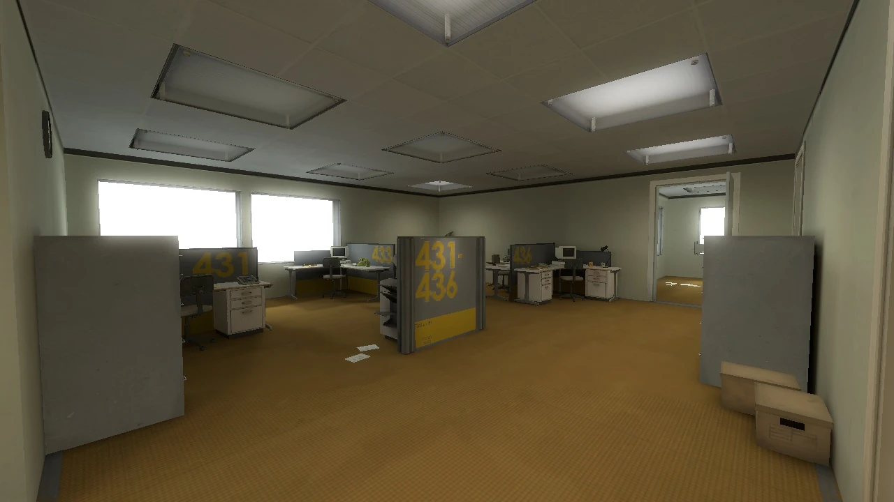

+++
authors = ["Duck Quack", "Scrooge McDuck"]
title = "The Quill of Duck"
description = "This is a Duckquill post example, this post has nothing but a bunch of text and random formatting, acting like a demo."
date = 2023-08-31
updated = "2024-06-21"
[taxonomies]
tags = ["Demo", "Test"]
[extra]
banner = "banner.webp"
toc = true
trigger = "This page contains blackjack and hookers, and bad jokes such as this one."
disclaimer = """
- All tricks in this page are performed by the lab boys, don't try this at home.
- Don't expose yourself to 4000° kelvin.
- Don't take party escort submission position.
- Don't interact with asbestos and moon rocks.
"""
[extra.comments]
# Long thread with image
#
# host = "mastodon.social"
# user = "brownpau"
# id = "104529877688537579"
#
# Thread with multiple images per post
#
# host = "mastodon.blaede.family"
# user = "cassidy"
# id = "112774854109302186"
#
# Post on GoToSocial
#
# host = "alpha.polymaths.social"
# user = "orbitalmartian"
# id = "01J7ETKJ19FGBDQGS1ZWZ3KEPP"
#
# Post on Sharkey
#
# host = "is-a.wyvern.rip"
# user = "volpeon"
# id = "9qy755nsnu2c0hbc"
host = "toot.community"
user = "sungsphinx"
id = "111789185826519979"
+++


Recommended banner dimensions are 2:1 aspect ratio and 1920x960 resolution.  
Other sizes will also work, but will be cut off at the bottom/won't be high enough.


## The what?

This is a Duckquill post example, this post has nothing but a bunch of text and random formatting, acting like a demo.

## Some info

Well, open this file and look at how it's made, it includes all the essential front matter stuff.

Now to the _Stanley!_

## The _Stanley_!

This is the story of a man named _Stanley_.

_Stanley_ worked for a company in a big building where he was Employee `#427`.

<figure>

<figcaption>The Office where Stanley works, it has yellow floor and beige walls</figcaption>
</figure>

Employee `#427`'s job was simple: he sat at his desk in Room `427` and he pushed buttons on a keyboard.

Orders came to him through a monitor on his desk telling him what buttons to push, how long to push them, and in what order.

This is what Employee `#427` did every day of every month of every year, and although others may have considered it soul rending,

_Stanley_ relished every moment that the orders came in, as though he had been made exactly for this job.

And _Stanley_ was happy.

And then one day, something very peculiar happened.

Something that would forever change _Stanley_;

Something he would never quite forget.

He had been at his desk for nearly an hour when he had realized not one single order had arrived on the monitor for him to follow.

No one had shown up to give him instructions, call a meeting, or even say 'hi'. Never in all his years at the company had this happened, this complete isolation.

Something was very clearly wrong. Shocked, frozen solid, _Stanley_ found himself unable to move for the longest time.

But as he came to his wits and regained his senses, he got up from his desk and stepped out of his office.

All of his co-workers were gone. What could it mean? Stanley decided to go to the meeting room; perhaps he had simply missed a memo.
